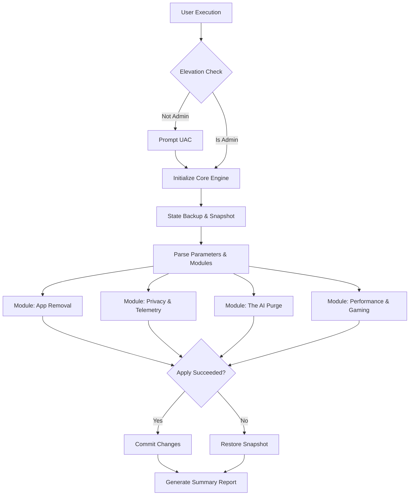

<p align="center">
  
</p>

<p align="center">
  
  
  
  
  
  
</p>

---

## What Winnow does

Winnow is an open-source PowerShell tool that strips bloat, telemetry, and clutter from Windows 11 while keeping what you actually use. It runs from a single file or the repository, with no install and no background services.

Unlike fire-and-forget debloat scripts, every change is checked and reversible. Winnow backs up the registry before it runs, rolls back automatically if an apply fails, verifies the machine actually reached the requested state, and ships reusable presets and localization. It works on a home PC, a gaming rig, or a fleet of provisioned workstations.

> Winnow is an independent project and is not affiliated with or endorsed by Microsoft. It is a rebranded fork of [Raphire/Win11Debloat](https://github.com/Raphire/Win11Debloat); see [CREDITS](CREDITS.md).

---

## 🎮 Engineered for Competitive Gaming & Low Latency

Stock Windows 11 ships with default scheduling intervals, background telemetry pipelines, and continuous recording hooks that introduce input lag, frame pacing jitter, and 1% low drops in competitive titles (Valorant, CS2, Apex Legends, Call of Duty, Fortnite).

Winnow provides a dedicated, non-destructive low-latency optimization stack designed to reduce OS-level microstutters. It modifies no anti-cheat or security components, so kernel anti-cheats (Vanguard, EAC, BattlEye, FACEIT) and official Windows Updates keep working.

<p align="center">
  
</p>

### 🕹️ Gaming Performance Stack

| Optimization Layer | Technical Implementation | Gaming Benefit |
|---|---|---|
| **0.5ms Timer Resolution** | Forces `GlobalTimerResolutionRequests = 1` in kernel session manager | Replaces 15.6ms default tick with 0.5ms high-precision scheduling, reducing frame-time variance on 144Hz-540Hz monitors |
| **BCD Clock Synchronization** | Sets `useplatformtick=yes` and `disabledynamictick=yes` | Eliminates timer drift and dynamic tick synchronization stalls across high-core-count CPUs |
| **Zero-Buffer Network Protocol** | Disables Nagle's Algorithm (`TcpAckFrequency = 1`, `TCPNoDelay = 1`) | Eliminates TCP packet buffering delay for instantaneous hit registration and network updates |
| **MMCSS Network Throttling Kill** | Sets `NetworkThrottlingIndex = 0xFFFFFFFF` and `SystemResponsiveness = 0` | Prevents Windows from throttling network traffic during intensive background multimedia tasks |
| **MMCSS Games Task Priority** | Sets `GPU Priority = 8`, `Priority = 6`, `Scheduling Category = High` | Grants game render threads top-tier GPU scheduler priority over desktop window manager processes |
| **Core Parking Elimination** | Disables CPU core parking via power policy (`ValueMax = 0`) | Prevents dormant CPU cores from entering deep C-states, eliminating latency spikes when cores wake up mid-match |
| **GameDVR & Game Bar Purge** | Disables `AppCaptureEnabled` and `AllowGameDVR` system-wide | Frees dedicated VRAM, disables background encoding buffers, and removes DWM capture hooks |
| **Defender Game Exclusions** | Whitelists Steam, Epic Games, and GOG directories via `Add-MpPreference` | Prevents real-time antivirus IOPS bottlenecks during in-game asset streaming and shader compilation |
| **1:1 Raw Input Parity** | Disables Windows pointer precision acceleration curves | Delivers true linear 1:1 hardware sensor tracking without erratic OS mouse acceleration |
| **Hardware GPU Scheduling** | Enables `HwSchMode = 2` (HAGS) in graphics driver registry | Offloads high-frequency scheduling tasks directly to GPU memory management hardware |

### ⚖️ Why Winnow vs. Alternatives?

| Feature / Criteria | Winnow | Stripped Custom ISOs (AtlasOS, ReviOS, Tiny11) | Generic Script Suites (Chris Titus, Sophia) |
|---|---|---|---|
| **Anti-Cheat Compatibility** | **Compatible** - modifies no anti-cheat or security modules (Vanguard, EAC, BattlEye, FACEIT) | Often broken due to stripped security modules | Mixed (some scripts break Hyper-V / VBS dependencies) |
| **Windows Update Support** | **Full Support** (Standard cumulative updates work normally) | Broken or permanently disabled | Supported |
| **Execution Architecture** | Native PowerShell 5.1 in-memory execution | Modified ISO reinstall required (data wipe) | External package managers and third-party CLIs |
| **Rollback & Safety** | Pre-run snapshot, automatic rollback on a failed apply, and per-feature `-Undo` | Impossible without full OS reinstallation | Manual registry inspection required |
| **Security Posture** | Retains core Defender & SmartScreen by default | Defender stripped completely (malware risk) | Toggles vary |
| **Verification Auditing** | Built-in `-Verify` and `-VerifyProfile` audit engine | No automated state verification | None |

For a fuller, sourced comparison against O&O ShutUp10++, Chris Titus WinUtil, and the Raphire upstream, including where those tools are the better choice, see [COMPARISON.md](COMPARISON.md).

---

---

## 🛡️ Windows 11 24H2 / 25H2 Compatibility Matrix

<p align="center">
  
  
  
  
</p>

Microsoft introduced six structural changes in Windows 11 24H2 that directly affect gamers and power users. Winnow handles each with a non-destructive, policy-level fix that preserves update integrity and kernel anti-cheat trust chains.

| Windows 11 Change | Impact Without Winnow | Winnow Fix | Implementation |
|---|---|---|---|
| **BitLocker Auto-Encryption** | Software BitLocker enabled silently on clean install - SSD write throughput reduced by up to 45% with risk of recovery-key lockout | Prevents auto-encryption before it activates | `Disable_Bitlocker_Auto_Encryption.reg` sets `PreventDeviceEncryption = 1` |
| **Windows Recall Snapshots** | Continuous NPU/CPU screenshot indexing consumes 3-8% CPU headroom during gaming sessions | Non-destructive policy suppression - no file deletion that could destabilize explorer.exe | `Disable_AI_Recall.reg` and `Disable_AI_Service_Auto_Start.reg` suppress Recall scheduling without touching CoreAIComponents binaries |
| **Modern Standby Network (S0)** | Network adapters stay active during sleep, draining laptop battery and generating thermal load | Enforces disconnected standby state | `Disable_Modern_Standby_Networking.reg` re-routes S0 into network-disconnected idle mode |
| **Windows Update Driver Overwrite** | Cumulative updates replace NVIDIA/AMD drivers with generic OEM packages, introducing microstutter after each patch cycle | Blocks WU from scanning and installing drivers | `Disable_WU_Driver_Search.reg` sets `ExcludeWUDriversInQualityUpdate = 1` |
| **Phone Link Start Menu Panel** | Microsoft injects Phone Link and Microsoft 365 promotional cards into Start Menu and Settings Home | Removes promotional injections without breaking shell binaries | `Disable_Phone_Link_In_Start.reg` and `Disable_Settings_365_Ads.reg` |
| **Click To Do and Edge AI** | Contextual AI analysis on cursor hover and Edge background AI inference workers consume idle CPU | Disables all context AI workers and Edge AI features | `Disable_Click_to_Do.reg`, `Disable_Edge_AI_Features.reg`, and `ExtendedAIPurge.ps1` |

> [!IMPORTANT]
> Winnow uses non-destructive GPO and registry policy suppression for all AI components. Aggressive binary deletion of `CoreAIComponents` causes `explorer.exe` and `SearchHost.exe` crash loops in 24H2 builds. Winnow never performs binary stripping.

### Anti-Cheat Safety Guarantee

Kernel anti-cheats (Riot Vanguard, Epic EAC, BattlEye, FACEIT) verify the integrity of specific Windows security components at driver initialization. Winnow is validated safe across all four:

| Anti-Cheat | Kernel Dependencies Preserved by Winnow |
|---|---|
| **Riot Vanguard** | Xbox Identity Provider, Windows Security Center API, Code Integrity services |
| **Epic EAC** | Windows Update service chain, UWP certificate stores, AppModel host |
| **BattlEye** | Windows Firewall service bindings, WMI repository, kernel patch guard |
| **FACEIT** | Hypervisor-Protected Code Integrity (HVCI), Secure Boot chain, TPM attestation |

Winnow disables only background behavior (DVR recording buffers, telemetry scheduled tasks, advertising ID generation) while keeping all security service binaries and registrations intact.

---

## 🔁 State Snapshot, Verification and Rollback Architecture

Winnow implements a three-stage execution safety model before and after applying any system modification.

### Stage 1 - Pre-Execution Snapshot

Before any registry key is written, Winnow captures a point-in-time backup of all registry paths scheduled for modification. The backup is written to `Backups\Winnow-RegistryBackup-<timestamp>.json`. If `-SkipRegistryBackup` is not specified, this step is mandatory and blocks execution on failure. A System Restore point is created before any of the four high-impact custom modules run.

### Stage 2 - Feature Apply Engine

The apply engine dispatches each feature through `Invoke-WinnowFeature`, which reads the registry target, expected value, and optional service or Appx action from `Config/Features.json`. Each operation is wrapped in `ShouldProcess` for `-WhatIf` support. No binary files are deleted. No Windows service registrations are removed from the service control manager database.

### Stage 3 - Desired-State Verification

After applying changes, or at any time using `-Verify` or `-VerifyProfile`, Winnow reads the actual system state and compares it against the requested configuration:

- Registry values: read back via `Get-ItemPropertyValue` and compared to the expected target.
- Appx packages: checked via `Get-AppxPackage` and `Get-AppxProvisionedPackage` to confirm removal across user and system contexts.
- Custom modules: verified through metadata-driven adapters for gaming, AI purge, security hardening, and telemetry firewall state.

Exit code `0` signals full compliance. Exit code `2` signals drift, an unsupported feature state, or a verification failure. This enables automated rollout pipelines and endpoint compliance auditing without manual inspection.

`-VerifyWatchdog` reports the update watchdog's own health separately: whether its SYSTEM scheduled task is registered, whether the payload still matches the hash recorded at install, whether its directory is still locked down, and when it last ran. It uses the same `0` healthy / `2` degraded exit codes.

### Stage 4 - Automatic Rollback

If the apply phase fails, Winnow restores the Stage 1 backup on its own rather than leaving a half-applied system. A registry import failure triggers the restore; the run then stops without attempting any undo work, because undo on top of a restored or partially changed system makes the final state harder to reason about.

An app removal failure does **not** trigger rollback. A registry backup cannot reinstall a removed Appx package, so restoring the registry there would report a recovery that did not happen while the apps stay gone.

Pass `-NoAutoRollback` to leave a failed run in place for inspection. Note that `-SkipRegistryBackup` removes the material rollback depends on, so the two are mutually exclusive in practice.

Rollback outcome, the condition that triggered it, and the backup file path are recorded in the run summary written to `%TEMP%\Winnow_RunSummary_<timestamp>.json`.

### Exit codes

| Code | Meaning |
|---|---|
| `0` | Success, or verification fully compliant |
| `1` | Generic failure |
| `2` | Verification noncompliant, unsupported, or failed |
| `3` | Apply failed and was rolled back cleanly |
| `4` | Apply failed and the rollback itself also failed |

Exit `4` is the only outcome that needs someone at the machine. A fleet script can retry on `3` and alert on `4`.

## ⚙️ How It Works

Winnow operates entirely in memory using standard PowerShell protocols. It takes a backup snapshot of your state, parses your configuration, and surgically removes or alters OS components.



---

## ✨ Core Capabilities

Winnow is divided into powerful, self-contained modules that target specific operational areas of the Windows environment. 

### 1. Privacy & Telemetry Hardening
Regain control over your data. Winnow cuts off diagnostics, tracking, and advertising pipelines at the root.

| Feature | Description | Impact Level |
|---|---|---|
| **Diagnostic Data** | Disables Windows diagnostic data collection and activity history. | High |
| **Telemetry Endpoints** | Applies outbound firewall rules to block telemetry servers, with HOSTS-file entries as a fallback when DNS resolution fails. | High |
| **Advertising IDs** | Turns off targeted advertising IDs and system-wide ad tracking. | Medium |
| **Ad Blocker** | Disables Start Menu suggested apps, Settings banners, and Lock Screen ads. | Medium |

### 2. App Removal & Bloatware Cleanup
Strip the operating system down to its bare essentials for maximum efficiency.

| Feature | Description | Impact Level |
|---|---|---|
| **OEM Bloatware** | Removes manufacturer-installed junkware and trial software. | High |
| **Consumer Apps** | Uninstalls TikTok, Candy Crush, and other consumer pre-installs. | Medium |
| **Start Menu Cleanup** | Unpins dead tiles and promotional shortcuts. | Low |
| **System Apps** | Safely removes unused built-in Windows applications via `Remove-AppxPackage`. | Medium |

### 3. The AI Purge (24H2 / 25H2)
For environments where embedded Generative AI is a liability or unwanted distraction.

| Feature | Description | Impact Level |
|---|---|---|
| **Windows Copilot** | Neutralizes Copilot integrations system-wide, including the taskbar icon. | High |
| **Windows Recall** | Disables Windows Recall snapshots and related background services. | High |
| **Click to Do** | Turns off contextual AI actions across the OS. | Medium |
| **Embedded AI** | Disables generative AI features in Paint, Notepad, and Photos. | Low |

### 4. Performance & Gaming Profiles
Unlock the full potential of your hardware with specialized tuning profiles.

| Mode | Target Audience | Key Adjustments |
|---|---|---|
| **Gaming Mode** | Gamers, Power Users | High Performance power plan, network latency optimization, disabled mouse acceleration, HAGS enabled. |
| **Esports Mode** | Competitive Gamers | Ultimate Performance plan, 0.5ms system timer resolution, CPU/GPU scheduling prioritization, core unparking. |
| **Defender Tweaks** | All Gamers | Whitelists game libraries (Steam, Epic, GOG) to prevent real-time scan overhead during gameplay. |

---

## 📖 Technical Documentation

For an in-depth look at our architecture, registry modifications, deployment methods, and security practices, see the technical wiki.

> 👉 **[Read the Winnow Technical Wiki](docs/WIKI.md)**

---

## ⚡ Quick Start

Download the standalone release asset when you need a single-file deployment. The standalone script contains the complete modular payload and launches it through Windows PowerShell 5.1.

```PowerShell
$scriptPath = Join-Path $env:TEMP 'Winnow-Standalone.ps1'
Invoke-WebRequest 'https://github.com/BiosSystem/Winnow/releases/latest/download/Winnow-Standalone.ps1' -OutFile $scriptPath
powershell.exe -NoProfile -ExecutionPolicy Bypass -File $scriptPath
Remove-Item -LiteralPath $scriptPath -Force
```

Clone the complete repository when you need modular source, configuration files, registry definitions, or development tools:

```PowerShell
git clone https://github.com/BiosSystem/Winnow.git
Set-Location .\Winnow
powershell.exe -NoProfile -ExecutionPolicy Bypass -File .\Winnow.ps1
```

Do not download and run `Winnow.ps1` by itself. The modular entry point requires the `Assets`, `Config`, `Regfiles`, `Schemas`, and `Scripts` directories.

> [!WARNING]
> While designed to be safe and reversible, modifying OS features carries inherent risks. Use at your own risk. Check out the [Wiki](docs/WIKI.md) for instructions on how to revert changes.

---

## Requirements and verification

Run Winnow with Windows PowerShell 5.1 through `powershell.exe`. Do not run the tool with PowerShell 7 because Appx removal and system restore cmdlets cannot complete correctly there.

Check selected feature state without applying changes:

```PowerShell
powershell.exe -NoProfile -ExecutionPolicy Bypass -File .\Winnow.ps1 -Verify -DisableTelemetry -DisableCopilot -Silent
```

Check an exported configuration or preset:

```PowerShell
powershell.exe -NoProfile -ExecutionPolicy Bypass -File .\Winnow.ps1 -VerifyProfile .\Config\DefaultSettings.json -Silent
```

Treat exit code `0` as compliant. Treat exit code `2` as noncompliant, unsupported, or failed verification. Review each result to identify registry values or Appx packages that remain outside the requested state. See the exit code table above for the rollback codes `3` and `4`.

Revert applied features without opening the GUI:

```PowerShell
powershell.exe -NoProfile -ExecutionPolicy Bypass -File .\Winnow.ps1 -CLI -Silent -Undo DisableTelemetry,DisableCopilot
```

`-Undo` accepts the 89 of 114 features that declare an undo registry file or have a dedicated undo routine. Anything else is rejected rather than reported as reverted.

Use `-SkipExplorerRestart` to defer the Explorer restart. Use `-NoAutoRollback` to keep a failed run in place for inspection. Use `-SkipRegistryBackup` only in controlled disposable environments, and note that it disables automatic rollback.

---

## 🤝 Contributing & License

Read the [Contributing Guidelines](CONTRIBUTING.md) before submitting a pull request.

Review [upstream credits](CREDITS.md) before redistributing a modified build.

Winnow is released under the MIT license.
